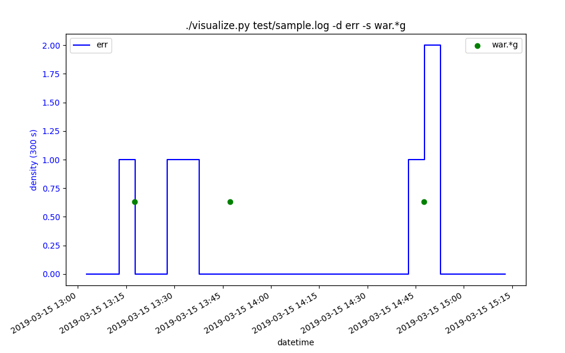

# Eventlog Visualizer

Eventlog Visualizer is a tool that show a graph of events over time in either of two representations:

    - 'spot': events are represented as points
    - 'density': the number of events per period is represented as a curve

This can help detect correlation between events.

## Usage

```
usage: visualize [-h] [-V] [-d PATTERN [PATTERN ...]]
                 [-s PATTERN [PATTERN ...]] [-f DATE_FORMAT]
                 [--density-window-size DENSITY_WINDOW_SIZE] [-t TITLE]
                 file

positional arguments:
  file                  log file

optional arguments:
  -h, --help            show this help message and exit
  -V, --version         print version and exit
  -d PATTERN [PATTERN ...], --density PATTERN [PATTERN ...]
                        pattern(s) for density representation (RegEx)
  -s PATTERN [PATTERN ...], --spot PATTERN [PATTERN ...]
                        pattern(s) for spot representation (RegEx)
  -f DATE_FORMAT, --date-format DATE_FORMAT
                        Date format for strptime (default
                        %Y-%m-%dT%H:%M:%S.%f)
  --density-window-size DENSITY_WINDOW_SIZE
                        Size of the time window for counting the density
                        (seconds). Default is 5 min.
  -t TITLE, --title TITLE
                        Set a title.
```


# Screenshot



